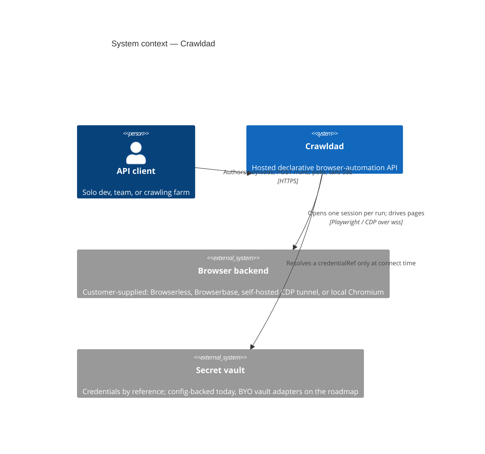
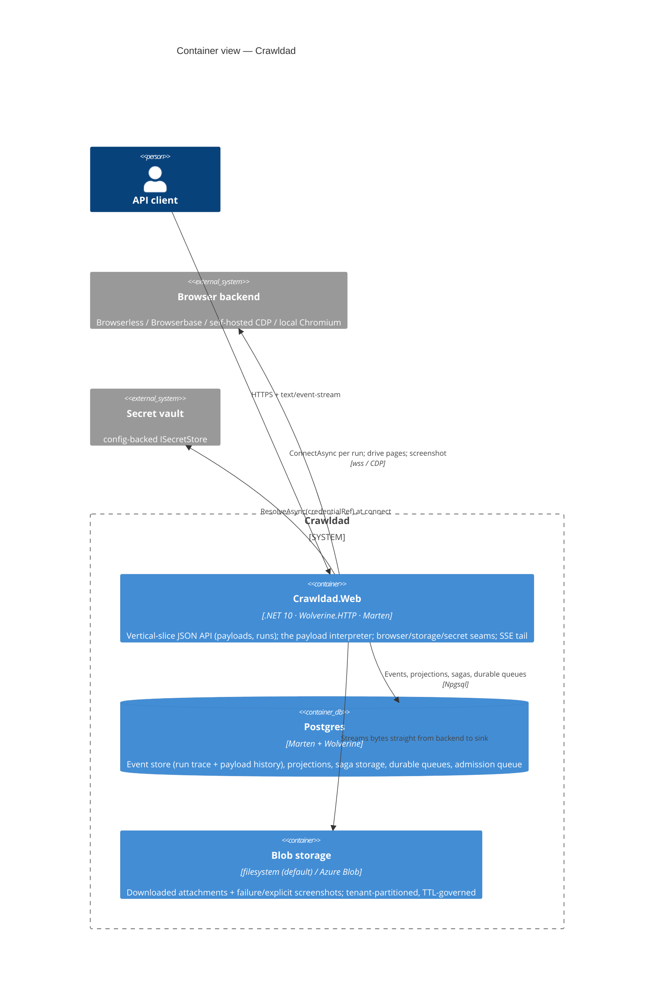
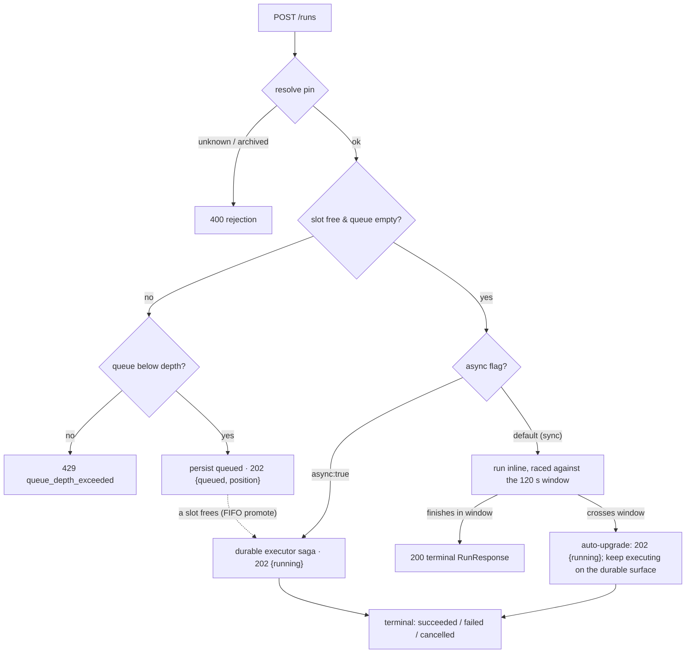

# Crawldad — Architecture

Crawldad is a hosted, closed-source **declarative browser-automation API**. A caller `POST`s one JSON payload describing a whole browser session — navigation, waits, clicks, form fills, extraction, downloads, and control flow — and the service executes it in Playwright against a **customer-supplied** browser backend, returning one structured result. This document has two parts: **(A) the system architecture** of the running application (verified against the code) and **(B) the infrastructure reference architecture** for hosting it on Azure. The behavioral contract of the engine lives in [`SPEC.md`](SPEC.md); the payload language in [`PAYLOAD_SPEC.md`](PAYLOAD_SPEC.md); the HTTP surface in [`API.md`](API.md); the security boundary in [`THREAT_MODEL.md`](THREAT_MODEL.md).

---

## Part A — System architecture

### A.1 Context

The founding boundary is **the service never owns browsers**. Customers bring their own browser compute (Browserbase, Browserless, a self-hosted CDP tunnel, or local Chromium); pricing attaches to managed payloads, observability, and durability, not to the browser. Everything below follows from that.

### A.2 Containers

Crawldad is a single .NET 10 host (Wolverine.HTTP JSON API + Marten event store + the JasperFx CLI) built on the Critter Stack. It is API-only — no Blazor. Postgres is the one datastore: it is simultaneously the Marten event store, the projection/document store, the Wolverine durable-messaging substrate, and the durable admission queue.

### A.3 Components inside the host

The host is organized as vertical slices under `Features/` plus shared seams under `Infrastructure/`.

- **Payloads slice** (`Features/Payloads`) — a managed payload is an **event-sourced aggregate** whose stream *is* its version history (`PayloadDrafted` → `PayloadRevised`/`PayloadRenamed`/`PayloadArchived`). Every save runs a scrub-then-validate gate (JSON Schema via `JsonSchema.Net` + a semantic walker), so a persisted revision is always executable and credential-free. A `PayloadSummary` projection backs listing.
- **Runs slice** (`Features/Runs`) — `POST /runs` admission and dispatch, the durable executor **saga**, the run **interpreter** (`Interpreter/`), the SSE tail, cancel/replay/drift/timeline/queue-stats endpoints, and the server-side resource limits. A run is an event-sourced aggregate whose trace events are the observability record; a `RunTimeline` projection is the lag-tolerant cross-run view; `RunProgress` is an executor-owned document holding the pollable state + the durable resume cursor; `QueuedRun` is the durable admission-queue entry.
- **Browser seam** (`Infrastructure/Browser`) — `IBrowserBackend` is an injected, Playwright-shaped seam resolved by data (`config.backend.adapter`) through a keyed registry. Shipped adapters: `fake` (record/replay over captured DOM on AngleSharp — deterministic, no Chromium), `local` (credential-free local Chromium), `browserless` (native `chromium.connect` via `/chromium/playwright`), `browserbase` (session-create → `connectOverCDP`). The three real adapters share one Playwright driver, a cross-run asset cache, and a global throttle gate.
- **Storage seam** (`Infrastructure/Storage`) — a config-selected blob backend (`Crawldad:Storage:Provider` = `filesystem` default / `azure` / `fake`) backs the download-sink registry, the screenshot store, and the retention store; a `RetentionJanitor` background service enforces TTLs. Downloads stream from the backend to the sink; the bytes **never enter an event, aggregate, or response** (only their content-addressed refs do).
- **Security seam** (`Infrastructure/Security`) — per-tenant API-key authentication, the tenant registry, the credential-by-reference secret store (+ keyed vault registry), the per-run secret scope, and the single credential scrubber. See [`THREAT_MODEL.md`](THREAT_MODEL.md).

### A.4 Persistence & messaging model

- **Event sourcing (Marten).** Payload history and run traces are event streams; observability *falls out* of modelling the run as an event-sourced aggregate rather than being bolted on. Read models (`PayloadSummary`, `RunTimeline`, the `Run` snapshot) are projections on a config-driven lifecycle (async in production via the daemon in `HotCold` mode; inline under the test switch).
- **Durable messaging & orchestration (Wolverine).** The long-running executor is a Wolverine **saga** with Marten-backed storage. Because messaging is durable (transactional outbox/inbox + durable local queues), orchestration survives process restarts and a run resumes from its last checkpoint. The saga carries the immutable run definition; the mutable execution state lives in the executor-owned `RunProgress` document so the long-running executor's own-session writes never contend with saga persistence.
- **Multi-tenancy.** Marten conjoined multi-tenancy (`AllDocumentsAreMultiTenanted()` + `Events.TenancyStyle = Conjoined`): one shared schema, every stream and row qualified by `tenant_id`, every session opened for a tenant. A cross-tenant read returns nothing → `404` (not `403`). The tenant flows into every session, including the out-of-request ones (the background executor reads `Envelope.TenantId`; startup recovery fans out over every configured tenant).

### A.5 Run lifecycle

`POST /runs` executes exactly one payload (inline, or a pinned managed payload). Pin resolution runs first — a bad `payloadId`/`revision`, or an archived payload, is a `400`, never queued. Then a **single admission decision** against the tenant's concurrent-run cap:

Key properties, all verified in code:

- **Sync by default, async as the workhorse.** A default run executes inline and returns the terminal `200` — the exact behavior of a purely synchronous service. It writes no background progress row, so `GET /runs/{id}` is `404` for it.
- **The 120 s sync cap with auto-upgrade.** A default run still executing when the synchronous window (`Crawldad:Limits:SyncUpgradeThresholdMs`, default **120 000 ms**) elapses is **auto-upgraded, not failed**: it keeps executing on the durable executor, the caller receives `202 { runId, status:"running" }` at the moment of upgrade, and then follows the async surface (`GET`/SSE/cancel). A run finishing inside the window keeps today's synchronous body byte-for-byte. This exists because every viable Azure ingress kills a longer request first (Part B); the cap makes every sync request answerable — as a result or an upgrade — before ingress can. One deliberate consequence: the run executes on its own cancellation source, so a client disconnect no longer cancels an in-flight run — it is bounded by the sync window and then the run wall-clock deadline (`config.deadlineMs`, default **30 min**).
- **Slot admission queue.** At the tenant's concurrent-run cap the run is **queued, not rejected** (`202 { status:"queued", position }`); a queued *sync* run is upgraded to the async surface. It holds no slot, is persisted durably (`QueuedRun`), and when a slot frees the tenant's **oldest** queued run is promoted FIFO. The only `429` from admission is `queue_depth_exceeded`, past the per-tenant queue depth. See [`API.md` §4](API.md) for the wire shapes.
- **Cancellation & resumability.** Cancel appends `RunCancellationRequested` and raises a cooperative stop honored **between steps**; the executor tears the browser session down cleanly and reaches `cancelled` with a `partial`. Resume is **checkpoint-based, not event-replay**: a live browser session is external stateful IO that cannot be rebuilt by replaying events, so the run resumes from a declared `checkpoint` against a *fresh* session. The checkpoint contract is in [`SPEC.md`](SPEC.md#checkpoints--resumability).

Live progress streams over SSE (`GET /runs/{id}/events`): on connect the client backfills from the durable stream, then tails the live events to the terminal frame. Authoritative live state is read from the run's own event stream (read-your-writes), not the lagging cross-run projection.

---

## Part B — Infrastructure reference architecture

This part is the hosting design for Azure. It is driven by a small set of **constraints**; the reference architecture and the pricing model both fall out of them. All prices are USD/month and approximate; re-verify against current Azure and provider rates before committing. Example Bicep/workflows to realize this are tracked for review in **issue #50**.

### B.1 Constraint & bottleneck inventory

Legend: **[G]** global/architectural (scale-out does *not* fix it) · **[I]** per-instance (scale-out fixes it).

| Constraint | Scope | The fix in this architecture |
|---|---|---|
| **Ingress request-lifetime ceilings** | **[G]** | Async-by-default; the sync path is hard-capped at 120 s with auto-upgrade |
| **Outbound SNAT port exhaustion** | [I] | NAT Gateway (64,512 ports/IP) on the app subnet |
| **Postgres connections & event volume** | **[G]** | Pool caps + built-in PgBouncer; SKU sized to memory; archival of completed streams |
| **Per-instance memory (active runs, SSE)** | [I] | Scale out with KEDA on active-run/SSE count (not CPU) |
| **Blob storage cost + egress** | **[G]** (cost) | TTL lifecycle, the `MaxDownloadedBytesPerRun` cap, customer-storage targets |

**Ingress lifetimes — the sync-run killer [G].** Azure Front Door (Standard/Premium) caps origin response timeout at **240 s** (default 30 s). Container Apps' Envoy ingress cancels at **240 s** (Premium ingress stretches further but its tooling is immature). App Service kills requests at **~230 s**, not configurable — which disqualifies App Service generally. Only Application Gateway v2 tolerates long requests (1–86,400 s), at the cost of edge simplicity. SSE survives every hop because a 15–20 s heartbeat comment frame resets idle timers. **Conclusion:** a 30-minute *synchronous* request is architecturally dead on Azure; async + SSE is the shippable long-run UX, and the 120 s sync cap (Part A) is the mechanism that keeps every synchronous request under the wall.

**Outbound SNAT — the wss:// tax [I → G if unfixed].** Default platform SNAT allocates ~**128 ports per instance**; each active run holds at least one long-lived outbound wss/CDP socket, so the realistic ceiling without mitigation is ~50–80 concurrent runs per instance before *probabilistic* connect failures. A single **NAT Gateway** gives **64,512 SNAT ports per public IP** (up to 16 IPs ≈ 1M ports), dynamically shared across the subnet, for ~$32/mo + $0.045/GB. It removes SNAT from the risk register entirely and — because it is a *stable egress IP* — becomes a **product feature**: customers allowlist it on their firewalls, and it is the address a self-hosted/tunnel backend reaches. Non-optional in the reference architecture.

**Postgres — connections and event volume [G].** `max_connections` scales with memory (D2ds_v5/8 GiB ≈ 859; D4ds_v5/16 GiB ≈ 1,717; capped ~5,000). Consumers per instance: the Npgsql pool, the Marten async projection daemon (session-pinned advisory locks), Wolverine durable-queue polling, and SSE endpoints tailing the event table. Mitigation: cap the Npgsql pool at ~50/instance; enable the Flexible Server **built-in PgBouncer** (port 6432, transaction mode) for HTTP-request-scoped Marten sessions, but keep the projection daemon and Wolverine on **direct** connections (their advisory locks are session-pinned and break under transaction pooling). Event volume is the sleeper cost: a large run emits hundreds of semantic step events (~0.5–1 MB/run with metadata-only discipline), so ~100k runs/mo ≈ **50–100 GB/mo** of event-store growth. The `MaxEventsPerRun` cap (default 100,000) bounds a single run; archival of completed streams to customer storage after the retention window keeps the aggregate bounded (**issue #46**).

**Compute / Kestrel [I].** Budget ~1–3 MB per active run or SSE client; a 4 GiB container comfortably holds ~500–1,000 SSE clients + ~100–200 active interpreters. Interpreters are I/O-idle most of the time, so autoscale on **active runs + SSE connections**, not CPU. Wolverine's durable local queues handle far more messages/sec than run orchestration produces, so Postgres is the binding datastore, not the queue.

**Blob storage [G — cost].** Azure Blob LRS is ~$0.018/GB-mo hot, ~$0.01 cool; internet egress is ~$0.05–0.087/GB after the free 100 GB. Screenshots are PII-bearing, so their short TTL (7 days) is both a security control and a cost control. The egress abuse vector — a payload that downloads gigabytes repeatedly — is bounded by `MaxDownloadedBytesPerRun` (default 1 GiB) and defused entirely by streaming bytes to *the customer's* storage.

**Browser economics.** Managed browser compute (e.g. Browserbase) runs ~$0.10–0.12/browser-hour (~$0.002/min), and its concurrency caps are **account-level**. Under the transparent BYO model the browser is the *customer's* account, so this is our cost only for the small dev account used by canaries/CI. It remains relevant to the customer's own capacity planning and is why slot counts are sized congruently with what their browser vendor sells them (see [`BUSINESS_MODEL.md`](BUSINESS_MODEL.md)).

### B.2 Azure reference architecture

| Layer | Choice | Notes |
|---|---|---|
| Compute | **Container Apps, Dedicated workload profile** | 2× (2 vCPU / 4 GiB) D4 to start (~$250–300/mo); **min replicas 2**; KEDA custom scaler on active runs + SSE, not CPU. Not App Service (~230 s timeout), not AKS (a solo-maintainer monolith does not need cluster ops; an ACA→AKS move is easy because everything is one container). |
| Front door | **Azure Front Door Standard** | ~$35–40/mo for TLS/WAF/anycast; its 240 s cap is fine because the app caps sync at 120 s itself. Set the ingress request timeout to **~180 s** (≥120 s + margin, comfortably <240 s). SSE with a 15 s heartbeat. |
| Outbound | **NAT Gateway on the app subnet** | Day one, non-negotiable; a stable egress IP for firewall allowlists and tunnel backends. |
| Database | **Postgres Flexible Server D4ds_v5** | ~$250–350/mo; built-in PgBouncer for request-scoped sessions; projection daemon + Wolverine on direct connections; Npgsql pool ≤50/instance. HA on at GA. |
| Blob | **Azure Blob (LRS)** | `downloads/`, `screenshots/` per tenant; TTL lifecycle (downloads 30 d, screenshots 7 d by default) is enforced host-side by the retention janitor uniformly across providers. |
| Secrets | **Key Vault + Managed Identity** | Backs the operator's own secrets and the default secret store; the keyed vault registry lets a customer's own vault plug in per tenant (roadmap). |
| Observability | **Azure Monitor + Log Analytics; OTel from .NET** | The must-have custom dashboard is the constraint dashboard: active runs by tenant, slot-queue depth, Postgres connections, event-table growth/day, SNAT allocation, SSE count. Every **[G]** row above gets an alert. |

**Reference bill — steady state (transparent BYO model).** Because browser compute is the customer's, the managed-browser line item is a small dev account for canaries/CI, and screenshots/downloads increasingly stream to customer storage, so blob shrinks to a few GB of our own artifacts:

| Component | ~$/mo |
|---|---|
| ACA 2× D4 replicas | 280 |
| Postgres D4ds_v5 + storage | 320 |
| Front Door Standard | 40 |
| NAT Gateway | 35 |
| Blob (our own artifacts) | 3 |
| Key Vault, Monitor, misc | 60 |
| **Total infra floor** | **~$740/mo** |

The platform is structurally cheap because the expensive part — browsers — is the customer's. See [`BUSINESS_MODEL.md`](BUSINESS_MODEL.md) for how this floor relates to pricing.

### B.3 The POC consumption-based floor

The ~$740/mo figure is a *production* floor. For a proof of concept, consumption-based options reach **~$27/mo idle, ~$35/mo light use** (or ~$13/mo on a 12-month Azure free account) — validating the *same* ingress contract, not a toy variant.

- **Compute → Container Apps Consumption plan**, same container, `min-replicas=1`, 0.5 vCPU / 1 GiB ≈ **$10–15/mo**. The scale-to-zero trap is real and stated honestly: at 0 replicas nothing polls Wolverine's queues, a scheduled `RunDeadline` sits past its due time, the recovery scan does not run, and SSE clients cannot connect. `min-replicas=1` is recommended — it buys production shape (sagas, deadlines, projections, SSE all work unmodified) at hobby price; the ~$10 saved by scaling to zero is not worth "deadlines silently late."
- **Database → Postgres Flexible B1ms burstable** (~$12–16/mo, or $0 on the 12-month free account). Respect the ceiling: ~2 GiB → ~35 usable connections, so one replica with a small Npgsql pool fits; that ceiling (not CPU) is what forces the first SKU bump.
- **Drop** Front Door (use ACA's built-in Envoy ingress — same 240 s cap, so the 120 s sync rule is unchanged), NAT Gateway (default SNAT is ample at 1–2 concurrent runs), zone-redundancy/HA, and min-2 replicas.

**Graduation triggers (each a metric, not a vibe):** sustained >5–10 concurrent runs or first SNAT failures → VNet + NAT Gateway; first paying customer → min-replicas=2 + Postgres SKU bump + PgBouncer + HA; Postgres connections >70 % of the ceiling → SKU bump; CPU throttling killing interpreters → Dedicated profile; public-launch/WAF need → Front Door.

### B.4 The outbound-in-reverse topology

Crawldad always dials **out** (wss/CDP), so each persona's only question is "can our egress IP reach your CDP endpoint?"

- **Team → Browserbase/Browserless:** the designed happy path; nothing to build.
- **Crawling farm → their data centers:** the farm exposes a TLS-terminated CDP edge and allowlists Crawldad's **stable NAT Gateway egress IP**.
- **Solo dev → their own machine:** the documented on-ramp is a dev tunnel they already know (`ngrok`/`cloudflared` exposing local Chrome's `--remote-debugging-port`); the resulting public wss URL is the backend binding. The tunnel URL is **credential-bearing** — it is passed as a `credentialRef` and scrubbed exactly like a Browserbase connect URL (see [`THREAT_MODEL.md`](THREAT_MODEL.md)). Latency makes a public tunnel an authoring/debugging topology, not production — the natural upsell to a real backend. Documenting this on-ramp (and tuning connect retry/backoff for tunnel flakiness) is tracked in **issue #45**. A hosted-side relay for reaching an on-prem browser with no public endpoint stays deferred to the Enterprise case.

The Enterprise deployment boundary is decided (issue #49): Enterprise runs as an **operator-managed dedicated instance** — single-tenant Crawldad deployed and operated by us in the customer's cloud subscription or a VNet-peered enclave. The App-Gateway-for-long-sync variant lives in that dedicated topology.
