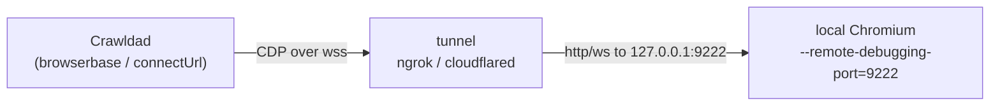

# Tunnel backend — the local-Chromium on-ramp

Crawldad never owns browsers: every run connects **out** to a customer-supplied backend and drives it over
Playwright/CDP ([`ARCHITECTURE.md`](ARCHITECTURE.md#a1-context)). The cheapest backend a solo dev can bring is
the one already on their laptop — a local Chromium exposed through a dev tunnel (`ngrok`/`cloudflared`) they
likely already use for webhooks. This guide is that on-ramp end-to-end: launch Chromium with a CDP port, point
a tunnel at it, and hand Crawldad the resulting `wss://` URL as a backend binding.

This is an **authoring/debugging** topology, not production: a public tunnel adds real round-trip latency and a
laptop physically caps at 1–2 concurrent browsers ([`BUSINESS_MODEL.md`](BUSINESS_MODEL.md)). It is the free
tier's front door and the natural upsell to a managed backend (Browserbase/Browserless) once a payload works.

Every claim below is verified against the code in
[`src/Crawldad.Web/Infrastructure/Browser/`](../src/Crawldad.Web/Infrastructure/Browser). Where the behavior is
Chrome's or the tunnel tool's rather than Crawldad's, that is called out — those flags evolve, so check the
tool's current docs.

## 1. How the connection is shaped

Crawldad reaches a tunnel through the **`browserbase`** adapter in **`connectUrl`** mode. The adapter is named
for its primary provider, but `connectUrl` mode is provider-agnostic: the resolved credential **is** the whole
CDP connect URL, and the adapter connects straight over CDP to it with `chromium.connectOverCDP` — it makes no
provider API call in this mode. That is exactly a self-hosted CDP tunnel: one URL, connected to over CDP.

Because the URL alone grants full control of the browser, it is treated as a **one-time secret** — passed by
reference (`credentialRef`), resolved only at connect time, and scrubbed from every sink (see [§8](#8-security-the-url-is-a-secret)).



## 2. Launch local Chromium with a CDP port

Start any Chromium/Chrome with a remote-debugging port bound to loopback:

```bash
# macOS example path; use your platform's Chrome/Chromium binary
"/Applications/Google Chrome.app/Contents/MacOS/Google Chrome" \
  --remote-debugging-port=9222 \
  --remote-debugging-address=127.0.0.1 \
  --user-data-dir="$HOME/.crawldad-chrome"
```

This exposes Chrome's DevTools/CDP endpoint at `http://127.0.0.1:9222`. Confirm it is up:

```bash
curl -s http://127.0.0.1:9222/json/version
# → {"Browser":"HeadlessChrome/…","webSocketDebuggerUrl":"ws://127.0.0.1:9222/devtools/browser/<id>", …}
```

The `--remote-debugging-port` launch and the `http://127.0.0.1:<port>` endpoint are the exact shape Crawldad's
own real-Chromium tests connect over (`tests/…/RealChromiumFixture.cs`), so a working `curl` here means the
adapter can connect once a tunnel fronts it.

## 3. Open a tunnel at the CDP port

Point a tunnel at port 9222. Both tools give you a public HTTPS/WSS hostname:

```bash
# ngrok — rewrite the Host header so Chrome's DevTools host check accepts it
ngrok http 9222 --host-header=rewrite
# → Forwarding  https://d34db33f.ngrok-free.app -> http://localhost:9222

# cloudflared — quick tunnel (ephemeral trycloudflare.com hostname)
cloudflared tunnel --url http://localhost:9222 --http-host-header localhost:9222
# → https://random-forest-1234.trycloudflare.com
```

**Chrome's host check (tool behavior, not Crawldad's).** Chrome's remote-debugging endpoint rejects requests
whose `Host` header is not `localhost`/an IP (a DNS-rebinding guard), answering `403` for a raw tunnel host. The
`--host-header` (ngrok) / `--http-host-header` (cloudflared) rewrite above makes the tunnel present
`localhost:9222` upstream so the handshake succeeds. Exact flag names drift between tool versions — verify
against the tool's current docs if the connect returns `backend_unavailable`.

## 4. The connect URL to hand Crawldad

Playwright's `connectOverCDP` — the call the adapter makes — accepts **either** form of the endpoint, so use
whichever the tunnel gives you:

- the **HTTP endpoint** form, e.g. `https://d34db33f.ngrok-free.app` (Crawldad fetches `/json/version` to
  discover the browser WebSocket) — the simplest, and the form the adapter is tested against; **or**
- the **browser WebSocket** form, e.g. `wss://d34db33f.ngrok-free.app/devtools/browser/<id>` (the
  `webSocketDebuggerUrl` from step 2, with the host swapped for the tunnel host).

Either string is the credential. Both are equally sensitive — the `/devtools/browser/<id>` path is itself a
bearer token.

## 5. Give Crawldad the backend binding

**(a) Store the URL as a connect secret.** Backend connect resolves `Secrets:<credentialRef>` from the
operator's configuration (`ConfigurationSecretStore`; connect secrets are process-global, not tenant-scoped).
Put the tunnel URL there under a reference name you choose:

```jsonc
// appsettings / env / user-secrets — the value is the tunnel URL, never checked into a payload
"Secrets": { "my-laptop-tunnel": "https://d34db33f.ngrok-free.app" }
// env-var form: Secrets__my-laptop-tunnel=https://d34db33f.ngrok-free.app
```

**(b) Reference it in the run's `backend` input.** A `backend` input value ([`API.md` §2.1](API.md#21-inputs))
selects the adapter and carries the credential by reference:

```jsonc
{
  "adapter": "browserbase",
  "credentialRef": "my-laptop-tunnel",
  "options": {
    "mode": "connectUrl",   // the resolved secret IS the CDP URL; connect straight over CDP
    "region": "laptop"      // free-form cache-locality tag; optional (defaults to "unknown")
  }
}
```

**(c) Author a payload that takes a backend by reference** — nothing tunnel-specific; the same payload runs
against any backend:

```json
{
  "crawldad": "1",
  "name": "tunnel.smoke",
  "inputs": { "backend": { "type": "backend", "required": true } },
  "config": { "backend": "input.backend" },
  "steps": [
    { "goto": { "url": "https://example.com" } },
    { "waitForLoadState": { "state": "load" } },
    { "set": { "var": "title", "value": "trim(coalesce(text('h1'), ''))" } }
  ],
  "result": "{ title: title }"
}
```

**(d) Run it** ([`API.md` §3](API.md#3-running-a-payload--post-runs)) — supply the backend binding as the
`backend` input:

```jsonc
POST /runs
{
  "payload": { /* the tunnel.smoke payload above, inline — or a saved "payloadId" */ },
  "inputs": {
    "backend": {
      "adapter": "browserbase",
      "credentialRef": "my-laptop-tunnel",
      "options": { "mode": "connectUrl", "region": "laptop" }
    }
  }
}
```

A healthy tunnel returns the usual synchronous `200 { status: "succeeded", result: { title: … } }`.

## 6. Failure modes and what the API returns

A backend connect happens **once** per run, before the interpreter's retry layer, and any connect fault is a
**terminal** `backend_unavailable` ([`API.md` §12.3](API.md#123-run-failures--failurecode)) — HTTP `200` for a
sync run (a failed *run* is not a failed *request*), or the terminal state of a `202` async run. No page is
bound yet, so there is no failure screenshot. Connect-fault messages are **secret-free by construction**: the
raw provider error (which can embed the URL) is never wrapped into it — a hand-written message is used instead
([§8 security](#8-security-the-url-is-a-secret)).

| What went wrong | `failure.code` | `failure.message` |
|---|---|---|
| Tunnel down / URL unreachable / not a live CDP endpoint / Host-check `403` | `backend_unavailable` | `failed to establish a 'browserbase' backend session` |
| `credentialRef` omitted from the binding | `backend_unavailable` | `the 'browserbase' backend requires a credentialRef (an apiKey or a connectUrl)` |
| `credentialRef` names a secret the vault has no value for | `backend_unavailable` | `failed to establish a 'browserbase' backend session` (the missing-secret detail is folded into the secret-free connect message) |
| `adapter` misspelled (no such adapter registered) | `unknown_backend_adapter` | `no backend is registered for adapter '<name>'` |

The first three are `class: "terminal"` from the adapter; `unknown_backend_adapter` is a terminal interpreter
failure raised before connect is even attempted.

## 7. Connect retry & backoff under tunnel flakiness

The verified behavior, because a tunnel is the flakiest backend Crawldad supports:

- **Connect is single-shot.** `ConnectAsync` is called once, *outside* the interpreter's retry loop. A connect
  failure is terminal immediately — Crawldad does **not** retry the connect and applies **no** backoff to it. A
  momentarily-flaky tunnel (an `ngrok` cold start, a paused laptop) fails the run with `backend_unavailable`; to
  tolerate that, retry at the **caller** by re-issuing `POST /runs` once the tunnel is confirmed up. This is a
  deliberate design choice (a connect fault is terminal, not a retryable page condition), not a tuning gap, so
  it is left as-is.
- **`config.retry` wraps only the post-connect program.** `maxAttempts` re-runs the steps on the **same**
  already-established session — it never re-establishes the backend connection. `delayMs` is a **constant**
  delay between attempts (there is no exponential backoff; the schema's `retry.backoff` field is accepted but
  the engine applies a constant delay regardless of its value). Only `timeout` and `pageCrashed` are retryable
  (`retryOn`, defaulting to both); every other fault — including a connect fault — is terminal.
- **Consequence for a mid-run tunnel drop.** Because retries reuse the same session and never reconnect, a
  tunnel that dies mid-run is not something `config.retry` can heal. Keep the laptop awake and the tunnel up for
  the duration of a run; treat the public tunnel as an authoring topology and graduate to a managed backend for
  anything long-running.

## 8. Security: the URL is a secret

In `connectUrl` mode the whole tunnel URL is registered as a run secret at connect time and funnels through the
single [`CredentialScrubber`](../src/Crawldad.Web/Infrastructure/Security/CredentialScrubber.cs), so it never
reaches an event, a log line, the timeline, an SSE frame, the HTTP response, or an exception message
([`THREAT_MODEL.md`](THREAT_MODEL.md)). Two rules cover the tunnel shapes:

- **Exact-secret redaction** replaces the full registered URL — scheme, `ngrok-free.app`/`trycloudflare.com`
  host, the `/devtools/browser/<id>` path, and any query — wherever it appears in outbound text.
- **Known-param redaction** additionally redacts `apiKey`/`token`/`signingKey` query values on any host, so a
  tunnel URL carrying `?token=…` is scrubbed even in text that was never registered.

Both are exercised by the tunnel-shaped cases in
[`CredentialScrubberTests`](../tests/Crawldad.Tests/Unit/CredentialScrubberTests.cs). The one thing text
scrubbing cannot cover is a `screenshot` taken while a secret is rendered on-screen — do not place one there.
